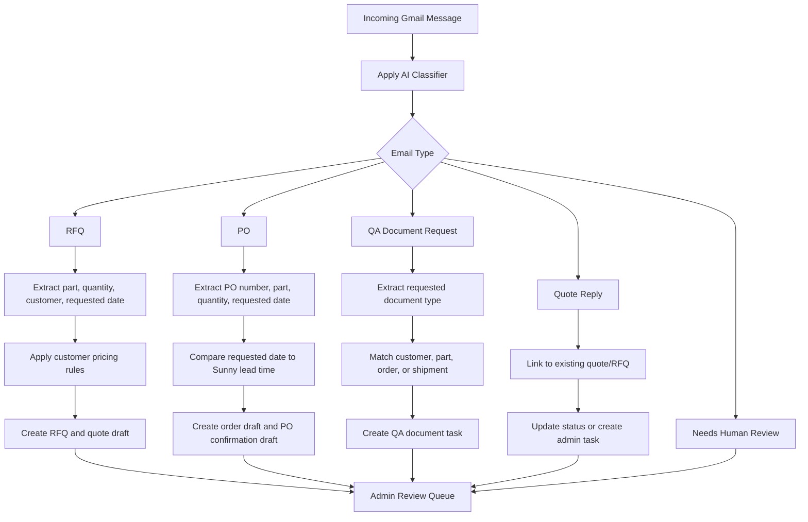

# SunnyKR AI Email Automation Blueprint

Status date: May 6, 2026

## Non-Negotiable Objective

SunnyKR.com must become a secure, scalable business portal that helps Sunny Electronics grow revenue, serve existing customers faster, win new customers, and eventually become a repeatable platform that can be duplicated for other businesses.

The AI email system must never expose confidential admin information, customer-specific pricing, master order data, or one customer's information to another customer.

## Recommended Starting Point

Start with an email copy/forwarding setup because Sunny's current working email is `john@sunny.co.kr` in company groupware/Outlook.

Do not disturb the current company email workflow. Forward a copy of incoming mail to a dedicated AI automation inbox and let SunnyKR AI read that copy first.

Preferred order:

1. Forward/copy company mail into a dedicated AI Gmail/Google Workspace inbox for the first live prototype.
2. Use PST files for historical import, training samples, and customer pattern matching.
3. Use IMAP/SMTP later if Sunny wants direct sending from `john@sunny.co.kr`.
4. Use Microsoft Graph only if the company mailbox is later confirmed to be Microsoft 365/Exchange.

Important rule: AI should create drafts and admin-review tasks first. Auto-send should come only after the system proves reliable with real Sunny emails.

## SunnyKR.com Project Files Root

Use this local folder as the SunnyKR.com source-of-truth file area:

`C:\Users\admin\Documents\New project\SunnyKR_Project_Files`

Automation folder usage:

- `07_RFQ_PO_Email_Samples`: confidential RFQ, PO, quote reply, stock inquiry, shipping, and QA request email examples for testing/training.
- `08_OrderList_Stock_Pricing`: confidential order list, stock, pricing, lead-time, and customer/vendor rule files.
- `04_Documents_SPA_Private`: private SPA-only workbooks/documents that must not be published publicly.

Current private workbook references:

- Order list workbook: `C:\Users\admin\Documents\New project\SunnyKR_Project_Files\04_Documents_SPA_Private\orderlist 26.05.06.xlsx`
- Sourcing schedule workbook: `C:\Users\admin\Documents\New project\SunnyKR_Project_Files\04_Documents_SPA_Private\sourcing schedule 26.05.06.xlsx`

These paths are exposed to the backend through environment variables, not browser code.

## Email Types To Detect

| Type                | Meaning                                      | System Action                                                    |
| ------------------- | -------------------------------------------- | ---------------------------------------------------------------- |
| RFQ                 | Customer requests price/quote                | Extract customer, part, qty, target date, create RFQ draft       |
| Quote Reply         | Customer replies to a quote                  | Link reply to quote/RFQ, update status, notify admin             |
| PO                  | Customer sends purchase order                | Extract PO number, part, qty, requested date, create order draft |
| QA Document Request | Customer asks for reports/certificates/specs | Create document request task and match part/order/customer       |
| Stock Inquiry       | Customer asks availability                   | Match part to stock and create response draft                    |
| General Message     | Anything uncertain                           | Route to admin review queue                                      |

## First Automation Workflow

## PO ETD Confirmation Rule

All customers use the Sunny lead time provided by admin for the relevant part/order.

| Case                                              | Rule                                            | Customer Reply                          |
| ------------------------------------------------- | ----------------------------------------------- | --------------------------------------- |
| Customer requested date is later than Sunny ETD   | Confirm customer's requested date if acceptable | Confirm requested date                  |
| Customer requested date equals Sunny ETD          | Confirm Sunny ETD                               | Confirm ETD                             |
| Customer requested date is earlier than Sunny ETD | Confirm Sunny ETD                               | Include: `Please review confirmed ETD.` |

## Security Requirements

Security is foundational and must be implemented in layers:

- OAuth mailbox access only; do not store email account passwords.
- Admin-only access to master order list, pricing, margins, internal notes, and all customer records.
- Customer portal must only query records belonging to that customer account.
- Passwords must be hashed; admin can reset passwords but cannot view raw passwords.
- Admin MFA is required before production use.
- Every AI-generated quote, PO confirmation, and QA response must be saved with source email, extracted fields, AI confidence, and admin approval status.
- Attachments must be stored securely and scanned/validated before opening or processing.
- AI must not auto-send externally until admin has approved the workflow for real production use.
- Every outbound auto/draft email must have an audit record.

## Data Model Needed

Initial database tables:

- `customers`
- `customer_contacts`
- `customer_price_rules`
- `parts`
- `stock_items`
- `lead_times`
- `email_messages`
- `email_attachments`
- `email_classifications`
- `rfqs`
- `quotes`
- `purchase_orders`
- `orders`
- `qa_document_requests`
- `admin_review_tasks`
- `audit_events`

## Build Checklist

### Phase 1: Intake Foundation

- [ ] Add database tables for customers, email messages, classifications, RFQs, POs, orders, QA requests, and review tasks.
- [ ] Add backend service interfaces for mailbox provider, AI classifier, extraction parser, and review task creation.
- [ ] Add Gmail OAuth configuration documentation and environment variables.
- [ ] Add admin review queue API endpoints.
- [ ] Store original email metadata and source message references.

### Phase 2: RFQ Detection

- [ ] Classify incoming messages as RFQ or non-RFQ.
- [ ] Extract customer, part number, quantity, target date, and notes.
- [ ] Match customer by sender domain/contact list.
- [ ] Create RFQ draft.
- [ ] Create quote draft using pricing rules.
- [ ] Require admin approval before sending.

### Phase 3: PO Detection

- [ ] Classify incoming messages as PO.
- [ ] Extract PO number, part number, quantity, customer requested date, and attachments.
- [ ] Create admin order draft.
- [ ] Compare requested date against Sunny lead time.
- [ ] Generate PO confirmation draft with ETD logic.
- [ ] Require admin approval before sending.

### Phase 4: QA Document Requests

- [ ] Classify QA document requests.
- [ ] Extract requested document type, part number, order/PO reference, and due date.
- [ ] Match available QA documents.
- [ ] Create admin task when documents are missing.
- [ ] Generate response draft.

### Phase 5: Controlled Auto-Send

- [ ] Define trusted customers and allowed auto-send scenarios.
- [ ] Require high AI confidence and complete extracted fields.
- [ ] Block auto-send when pricing, ETD, part number, customer, or attachment interpretation is uncertain.
- [ ] Keep full audit log of every automated action.

## Immediate Next Implementation Step

Build the backend foundation first:

1. Load RFQ/PO samples from `07_RFQ_PO_Email_Samples` after they are masked or approved for internal AI testing.
2. Import the order list and sourcing schedule into database tables or a private ingestion job.
3. Connect Gmail OAuth to the dedicated automation inbox.
4. Keep Gmail intake in draft/admin-review mode until Sunny explicitly enables controlled auto-send.
