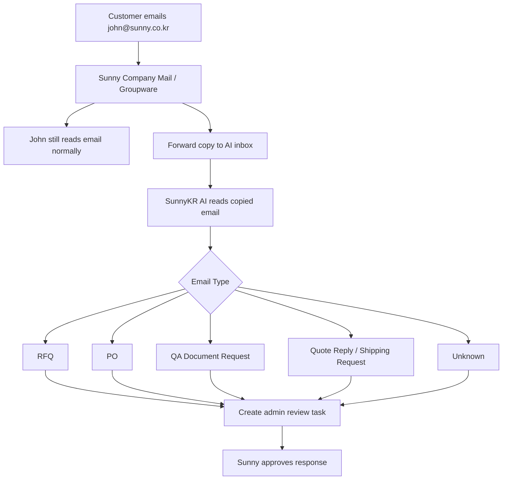

# SunnyKR Simple Email Setup Decision

Status date: May 4, 2026

## Simple Decision

Keep Sunny's current company email exactly as-is.

Do not replace Outlook, LG/groupware, or `john@sunny.co.kr` right now.

The safest and easiest first setup is:

1. Incoming customer emails continue to arrive in Sunny company mail.
2. A copy of those emails is forwarded to a separate AI automation inbox.
3. SunnyKR AI reads only the copied emails.
4. AI creates admin review tasks and draft replies.
5. John/Sunny approves before anything is sent to customers.

## Why This Is Best First

- No disruption to current email work.
- No risky change to the company mail system.
- Easy to turn off if needed.
- AI can start learning RFQ, PO, quote reply, QA request, and shipment request emails.
- Original customer emails stay in the company mailbox.
- We can move fast without waiting for deep IT setup.

## Recommended Automation Inbox

Create a dedicated automation mailbox, not a personal mailbox.

Good names:

- `sunny.ai.inbox@gmail.com`
- `sunnykr.ai@gmail.com`
- `ai@sunnykr.com`
- `automation@sunnykr.com`

Best long-term choice:

`automation@sunnykr.com`

Fastest first choice:

A dedicated Gmail/Google Workspace inbox used only for AI processing.

## First Workflow

## Sending Replies

Phase 1:

- AI creates draft text only.
- John/Sunny reviews and sends manually from normal email.

Phase 2:

- SunnyKR creates draft replies inside the automation system.
- Admin clicks approve/send.

Phase 3:

- Safe repeat cases can be auto-sent only after Sunny approves that rule.

## What To Set In Groupware

Use the groupware forwarding tab if available.

Set forwarding/copy rule:

- From: `john@sunny.co.kr`
- To: dedicated AI inbox
- Keep original email in Sunny company mailbox
- Forward a copy only

Important:

Do not delete original emails after forwarding.

## What The AI Will Detect First

- RFQ
- PO
- Quote reply
- QA document request
- Stock inquiry
- Shipping status request
- Payment/shipment follow-up
- Unknown/needs review

## Security Rule

The AI inbox is for reading copied emails only. It does not get admin pricing access by itself.

Pricing, master orders, customer lists, and confidential data stay inside the SunnyKR backend/admin system with protected access.

## Next Build Step

Build Gmail intake for the AI automation inbox first, because it is the easiest and least disruptive way to start.

Keep Outlook/PST import for history and training.

Keep IMAP/SMTP integration for later if Sunny wants direct sending from `john@sunny.co.kr`.

